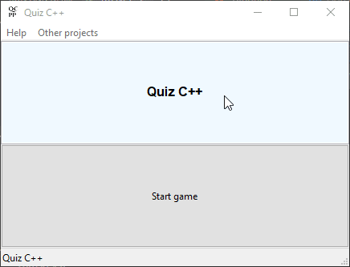

# Quiz C++

## Description 
Quiz game written in C++ using wxWidgets framework.

## License 
MIT

## Technology/Tools 
1. wxWidgets 3.1.4
2. JSON (https://github.com/open-source-parsers/json)
3. CMake
